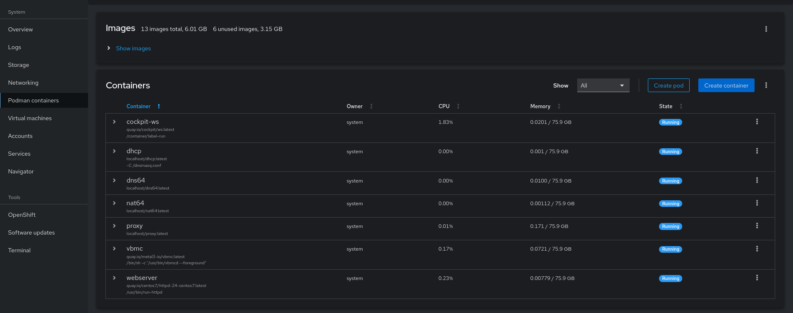

# OpenShift Bare Metal IPI Cluster

The bare metal IPI cluster deployment does not require any configuration in OpenShift Network Playground. Once the ONP is ready, the `onp deploy RELEASE=stable` command can be executed to start the installation. The Cockpit also gives the option to do the deployment.

<figure><figcaption></figcaption></figure>

## How it works

It uses VirtualBMC service in front of the cluster nodes. In the `install-config.yaml` file, the BMC information will be shared. The installer interact with the VBMC to turn ON the nodes when it requires. To know more about VBMC, please see [this](https://github.com/openstack/virtualbmc).

