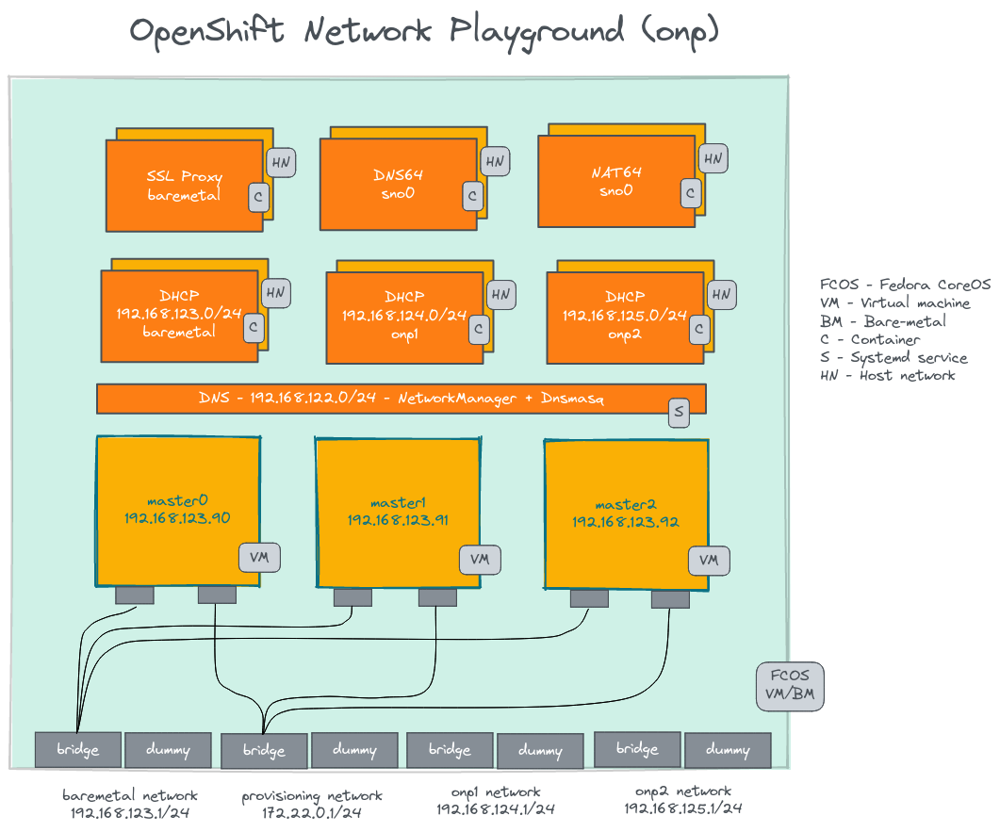

# Architecture

## Introduction to OpenShift Network Playground

OpenShift Network Playground is a lab environment for testing OpenShift network related scenarios. It is designed to allow OpenShift user reproduce or test a scenario in a fully customized OpenShift environment.

## Understanding OpenShift Network Playground

OpenShift Nework Playground will be deployed as a single machine. Fedora CoreOS is the operating system. On top of that, we create OpenShift cluster nodes by leveraging the nested virtualization. It also adds all the dependent components like DNS, DHCP, Proxy and network. The dependent componenets are running as containerized applications. We can interact with it using the `podman` command.

All the nework are using the bridge configuration. Since the compact OpenShift cluster uses the Bare metal IPI method, the `baremetal` and `provisioning` interfaces are dedicated for that. Rest of the interfaces can be bring up as per the requirement.

The configuration for all the above componenets are burned into the ignition file of the Fedora CoreOS.

<figure><figcaption></figcaption></figure>
