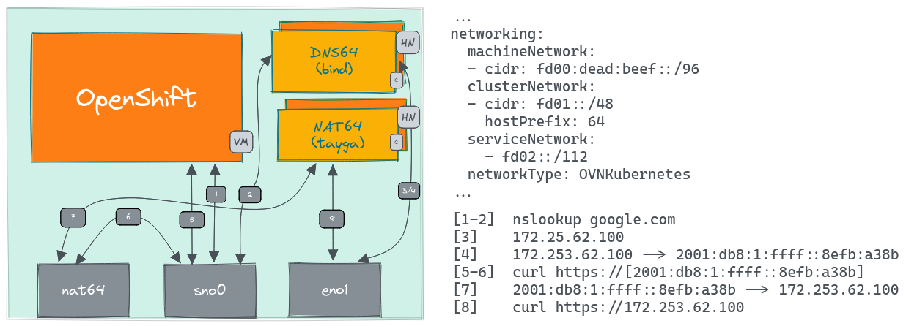

# NAT64

NAT64 is an IPv6 transition mechanism that facilitates communication between IPv6 and IPv4 hosts by using a form of network address translation (NAT). It uses `Tayga` package.

<table data-header-hidden data-full-width="false"><thead><tr><th width="242"></th><th></th><th data-hidden></th><th data-hidden></th></tr></thead><tbody><tr><td>Directory</td><td><code>/opt/openshift-network-playground/nat64/</code></td><td></td><td></td></tr><tr><td>Service</td><td><code>nat64.service</code></td><td></td><td></td></tr></tbody></table>

The `onp service` is the other command to check `nat64` status. It plays the key role in the single-stack IPv6 SNO cluster deployment.

The below diagram describes the connectivity flow of the NAT64 and DNS64.

<figure><figcaption></figcaption></figure>
