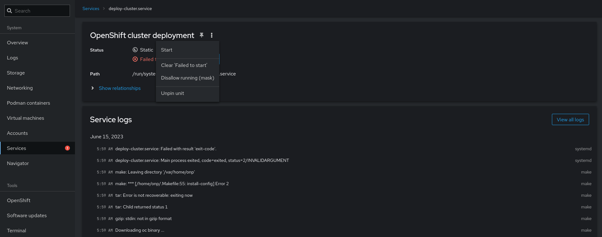

# Cockpit Cluster deployment

The OpenShift cluster will be deployed using a systemd service called `deploy-cluster.service`. If any issue occurs, the Services tab can be used and monitor the logs for hints. Once the issue is identified and fixed, it is required to clear the service to retry the deployment.

<figure><figcaption></figcaption></figure>
