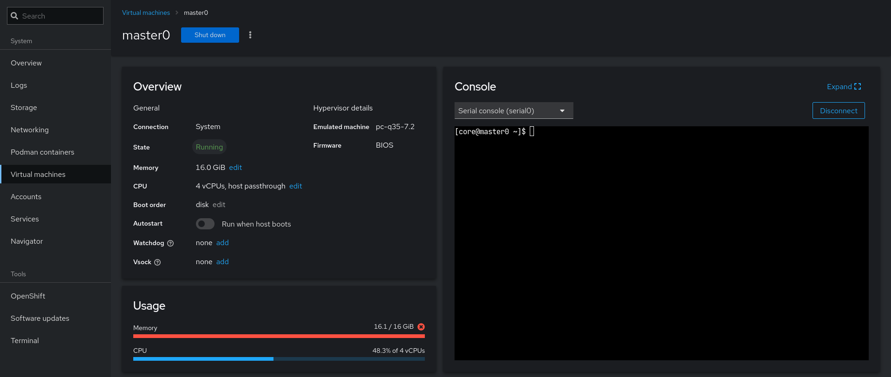

# Cluster Node Access

The OpenShift cluster node access is something that the user needs when it comes to network-related tasks because the cluster node access might be broken and the node will not be accessible through SSH connection in that case. The Cockpit console of the virtual machines solves that problem by leveraging the serial console feature of Libvirt.

<figure><figcaption></figcaption></figure>

<figure><figcaption></figcaption></figure>

<figure><figcaption></figcaption></figure>


**TIP**\
Press `Enter` when we select the Serial console (serial0) option to get the prompt.

