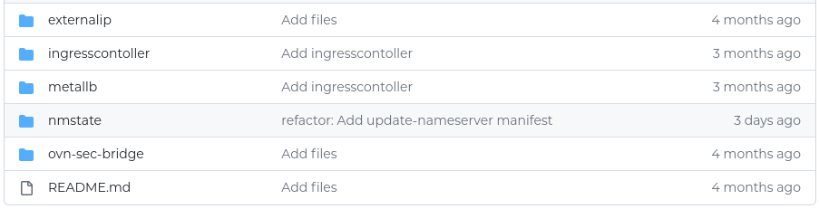

# Collection of Manifests

This is the [collection of manifests](https://github.com/kevydotvinu/onp-files) which are created with reproducers in mind. It contains minimal scaffoldings to start with.

<figure><figcaption></figcaption></figure>

To get started, it needs to switch to the CLI interface.

## Download the latest files

```
onp onp-files
Cloning onp-files ...
Cloning into 'onp-files'...
remote: Enumerating objects: 38, done.
remote: Counting objects: 100% (38/38), done.
remote: Compressing objects: 100% (29/29), done.
remote: Total 38 (delta 9), reused 35 (delta 7), pack-reused 0
Receiving objects: 100% (38/38), 8.70 KiB | 37.00 KiB/s, done.
Resolving deltas: 100% (9/9), done.
```

## Explore the files

```
cd onp-files
ls
README.md  externalip  ingresscontoller  metallb  nmstate  ovn-sec-bridge
```
