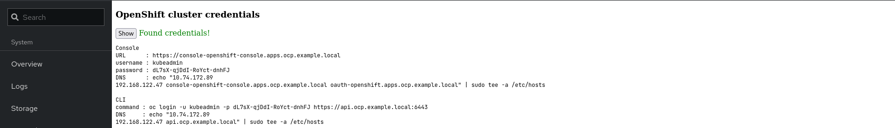

# OpenShift Bare Metal IPI Cluster

## How it works

It uses VirtualBMC service in front of the cluster nodes. In the `install-config.yaml` file, the BMC information will be shared. The installer interacts with the VBMC to turn ON the nodes when it requires. To know more about VBMC, please see [this](https://github.com/openstack/virtualbmc).

## Cockpit installation

The bare metal IPI cluster deployment does not require any configuration in OpenShift Network Playground. Once the ONP is ready, the `onp deploy RELEASE=stable` command can be executed to start the installation. The Cockpit also gives the option to do the deployment.

* Enter the release
* Enter `OCM_TOKEN`
* Click `Deploy`

<figure><figcaption></figcaption></figure>

<figure><figcaption></figcaption></figure>

The credentials of the newly deployed cluster can be shown by clicking the `show` button on the top.

<figure><figcaption></figcaption></figure>

## CLI installation

To deploy the cluster using the CLI, the onp command can be used.

```
onp deploy RELEASE=stable OCM_TOKEN=<ocm-token>
[...]
Creating cluster ...
INFO Consuming Worker Ignition Config from target directory
INFO Consuming Master Ignition Config from target directory
INFO Consuming Bootstrap Ignition Config from target directory
INFO Obtaining RHCOS image file from 'http://192.168.123.1:8080/rhcos-413.92.202305021736-0-qemu.x86_64.qcow2.gz?sha256=dec79efb470705174320ef502772489a67eeedac14457d0958fc541f635c4e28'
INFO The file was found in cache: /var/home/onp/.cache/openshift-installer/image_cache/rhcos-413.92.202305021736-0-qemu.x86_64.qcow2. Reusing...
INFO Creating infrastructure resources...
INFO Waiting up to 20m0s (until 1:43PM) for the Kubernetes API at https://api.ocp.example.local:6443...
INFO API v1.26.5+0001a21 up
INFO Waiting up to 1h0m0s (until 2:23PM) for bootstrapping to complete...
INFO Destroying the bootstrap resources...
INFO Waiting up to 1h0m0s (until 2:53PM) for the cluster at https://api.ocp.example.local:6443 to initialize...
INFO Checking to see if there is a route at openshift-console/console...
INFO Install complete!
INFO To access the cluster as the system:admin user when using 'oc', run 'export KUBECONFIG=/var/home/onp/openshift-network-playground/clusterconfigs/auth/kubeconfig'
INFO Access the OpenShift web-console here: https://console-openshift-console.apps.ocp.example.local
INFO Login to the console with user: "kubeadmin", and password: "ZDPfj-pLV45-PcADh-PUuRr"
INFO Time elapsed: 58m40s
```


**INFO**

Get OCM\_TOKEN from [https://cloud.redhat.com/openshift/token/show](https://cloud.redhat.com/openshift/token/show). It only requires at the first deployment. The pullsecret saves locally.



**INFO**

Multiple clicks on `Deploy` the button will not interrupt the OpenShift cluster installation. Stop `deply-cluster.service` before initiating the second cluster deployment.


## OpenShift Cluster Access



#### Inside ONP

```
oc get clusterversion
```


**INFO**

The `KUBECONFIG` environment variable has been configured in the `~/.bashrc`.


#### Outside ONP

```
echo "<onp-ip> api.ocp.example.local" | sudo tee /etc/hosts
oc login -u kubeadmin -p <password> https://api.ocp.example.local:6443
```



#### Inside ONP

It is not possible to access the OpenShift console from OpenShfit Network Playground.

#### Outside ONP


```bash
echo "onp-ip> console-openshift-console.apps.ocp.example.local oauth-openshift.apps.ocp.example.local" | sudo tee /etc/hosts
```


* [https://console-openshift-console.apps.ocp.example.local](https://console-openshift-console.apps.ocp.example.local)



